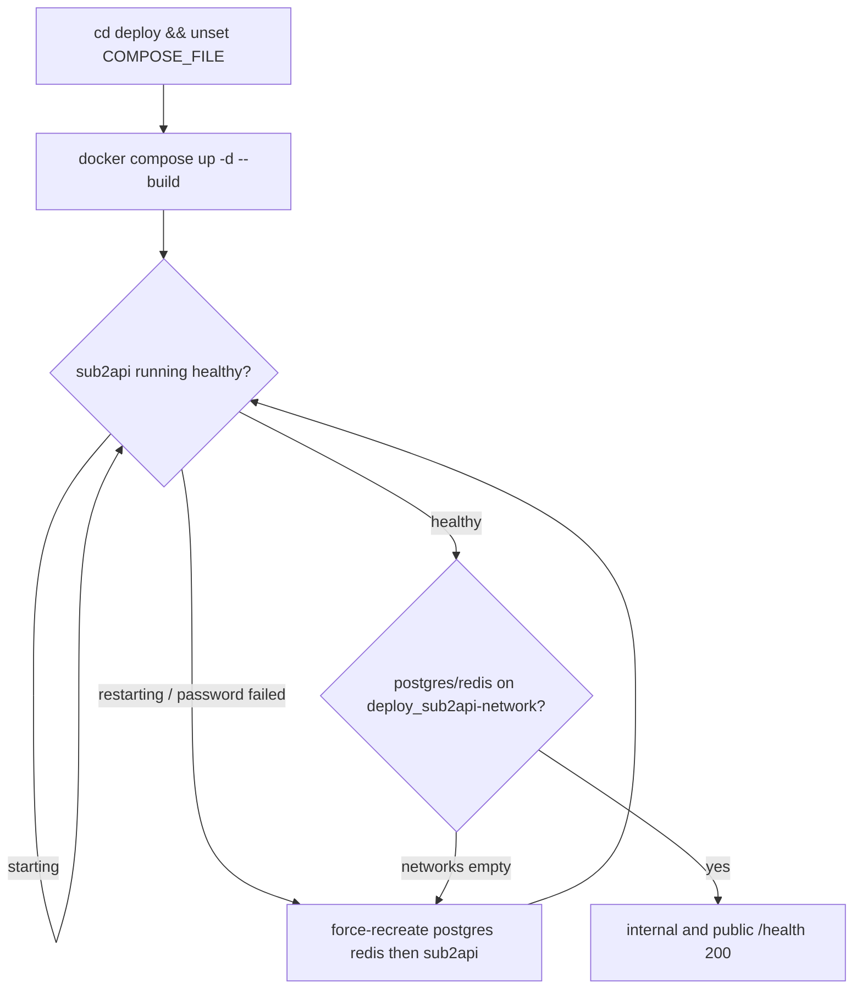

# Production release (sub2api.chainbow.io)

This is the baryon/chainbow fork, not upstream Weishaw. Product fixes are server-side only; do not tell users to edit `~/.codex`.

「上线吧 / 发布」means: commit remaining reviewed work if needed, **push**, then production deploy. That phrase is authorization. Do not force-push. Do not amend a commit that is already on the remote.

「恢复」without a new commit: skip push; still use the **same** server recipe below (never `-f`).

## Iron rules

1. On akiba, compose is **only** `docker compose …` with **no** `-f`. Never `-f docker-compose.local.yml`, `dev.yml`, or `standalone.yml` — not for `up`, not for `ps`, not for `images`, not for `logs`.
2. Run compose only in `/home/deploy/sub2api/deploy` after `unset COMPOSE_FILE`, so untracked `docker-compose.override.yml` auto-merges.
3. Do not run compose from the laptop repo. `ssh -p 220 -o BatchMode=yes` + a heredoc. Do not `ssh -tt`.
4. Upstream README / `deploy/README.md` / `deploy/DOCKER.md` recommend `docker-compose.local.yml`. That is **generic self-host**, not akiba. Ignore those examples on this host.
5. `docker compose -f docker-compose.local.yml ps` on akiba still lists the live containers (same names). That does **not** mean local.yml is the production stack. Using it for `up` stops the live stack.
6. Do not `down -v`, delete `deploy/data/`, or run `./deploy/docker-deploy.sh`.

## Production facts

| Item | Value |
| --- | --- |
| Public URL | `https://sub2api.chainbow.io` |
| SSH | `ssh -p 220 deploy@122.208.117.197` |
| Host | `akiba` / `akiba.chainbow.io` (same key as the IP) |
| User | `deploy` |
| Repo | `/home/deploy/sub2api` |
| Origin | `git@github.com:baryon/sub2api.git` |
| Branch | `main` |
| Compose cwd | `/home/deploy/sub2api/deploy` |
| Compose files | `docker-compose.yml` + untracked `docker-compose.override.yml` (auto-merged; `COMPOSE_FILE` unset) |
| App image | `sub2api:local` (`pull_policy: never`, built from repo-root `Dockerfile`) |
| Data | `deploy/data/{postgres,redis,sub2api}` via override, not named volumes |
| App network | `deploy_sub2api-network` with **fixed** subnet `10.88.100.0/24` |
| Public proxy | container also on external network `shared` (nginx-proxy). Do not publish host port 8080 |

There is no SSH Host alias `chainbow-deploy`. Do not use `chainbow-ropsten` / `chainbow-mainnet`.

Override vs `local.yml` (why `-f` is fatal):

| | Production override | `docker-compose.local.yml` |
| --- | --- | --- |
| Container names | `sub2api`, `sub2api-postgres`, `sub2api-redis` | **same names** |
| App / PG / Redis data | `./data/{sub2api,postgres,redis}` | `./data`, `./postgres_data`, `./redis_data` |
| Network | `10.88.100.0/24` + external `shared` | auto IPAM from Docker default pool |

Default pool on this host is `10.0.0.0/8` and is exhausted. Auto IPAM fails with `all predefined address pools have been fully subnetted`.

## Local: commit and push

1. Review. Run the affected Go tests. Do not ship secrets (`.env`, credentials).
2. Commit with repo style: `fix:` / `feat:` focusing on **why**. Example:

```bash
git add <files>
git commit -m "$(cat <<'EOF'
fix: keep official OpenAI Responses cache fields on compatible-safe accounts

EOF
)"
```

3. `git push origin HEAD` (usually `main`). Never `--force` to `main`. Never `--no-verify` unless the user asked.

Frontend is embedded in the Go image. A code change is not live until the server rebuilds.

## Server: pull and rebuild

This is the **only** allowed compose invocation on akiba.

```bash
ssh -p 220 -o BatchMode=yes deploy@122.208.117.197 'bash -s' << 'REMOTE'
set -euo pipefail
unset COMPOSE_FILE
cd /home/deploy/sub2api
git pull --ff-only origin main
cd deploy
docker compose up -d --build
docker compose ps
docker inspect --format '{{.State.Status}} {{.State.Health.Status}}' sub2api
docker inspect --format '{{json .NetworkSettings.Networks}}' sub2api-postgres
docker inspect --format '{{json .NetworkSettings.Networks}}' sub2api-redis
git log -1 --oneline
REMOTE
```

`up -d --build` rebuilds the **app** image. Postgres/Redis keep the bind-mounted data dirs. Schema migrations are forward-only; `AUTO_SETUP` will not wipe an existing admin.

Build can take several minutes (frontend + Go). Cached rebuilds can finish in seconds.

## Mandatory verify

Do not report success until all of these pass. `pg_isready` inside Postgres is **not** enough: that healthcheck is localhost and succeeds even when the container is off the Docker network.

1. `docker inspect` for `sub2api` prints `running healthy`. If it is still `starting`, poll. Do not restart blindly.
2. `sub2api-postgres` and `sub2api-redis` are `running healthy` **and** `NetworkSettings.Networks` contains `deploy_sub2api-network` with a real `10.88.100.x` IP (aliases `postgres` / `redis`). An empty `{}` is a failed deploy.
3. Internal: `docker exec sub2api wget -q -T 5 -O - http://localhost:8080/health` → `{"status":"ok"}`.
4. Public: `curl -fsS https://sub2api.chainbow.io/health` → HTTP 200 and `{"status":"ok"}`. Cloudflare **525** means origin TLS failed (usually nginx-proxy lost the backend because `sub2api` is down or off `shared`).
5. Server HEAD matches the commit just pushed.

```bash
ssh -p 220 -o BatchMode=yes deploy@122.208.117.197 \
  'docker exec sub2api wget -q -T 5 -O - http://localhost:8080/health'
curl -fsS https://sub2api.chainbow.io/health
```



## If verify fails

**Postgres/Redis `Networks` is `{}`**, or app logs `pq: password authentication failed for user "sub2api"`:

The app is on `shared` with many other stacks. Hostname `postgres` then hits the **wrong** database. Postgres can still look `healthy` via localhost `pg_isready`.

```bash
ssh -p 220 -o BatchMode=yes deploy@122.208.117.197 'bash -s' << 'REMOTE'
set -euo pipefail
unset COMPOSE_FILE
cd /home/deploy/sub2api/deploy
docker compose up -d --force-recreate --no-deps postgres redis
docker compose up -d --force-recreate --no-deps sub2api
REMOTE
```

Then re-run **Mandatory verify**. Do not change `POSTGRES_PASSWORD` to "fix" auth. Do not `down -v`.

**Cloudflare 525 / containers `Exited (0)`:** they were stopped (often by a `-f local.yml` `up`). Same recipe as **Server: pull and rebuild**, then the force-recreate block if networks are empty.

## Forbidden (this took production down on 2026-08-20)

```bash
# All of these are forbidden on akiba, including inspect-only:
docker compose -f docker-compose.local.yml ps
docker compose -f docker-compose.local.yml images
docker compose -f docker-compose.local.yml up -d --build
docker compose -f docker-compose.local.yml up -d --build sub2api
```

That `up` rebuilt the image, **stopped** `sub2api` / postgres / redis, deleted `deploy_sub2api-network`, then failed to create a replacement (`all predefined address pools have been fully subnetted`). Public site became Cloudflare 525. A later `up` without `-f` recreated the fixed `10.88.100.0/24` network and started the old Postgres/Redis containers **without attaching them**, which produced `password authentication failed`.

Also do not:

- `./deploy/docker-deploy.sh` (rewrites `deploy/.env`)
- `docker compose down -v` or delete `deploy/data/`
- compose from the **repo root** (override will not load)
- `docker compose pull` for the app image (it is local-only)
- force-push, amend after push, or change git config
- `ssh -tt` (hangup can interrupt compose mid-recreate)

## After deploy

Report: local commit SHAs, remote HEAD on `akiba`, container health, postgres/redis network attachment, internal `/health`, and public `/health`. Stop there unless the user asked for log digging.
